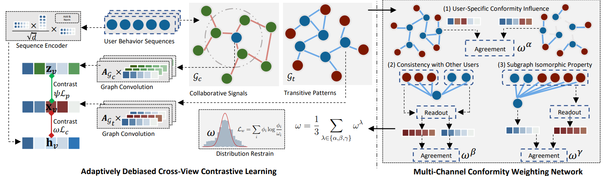

# ReChorus-Dcrec Extension



## Introduction

This repository extends the [ReChorus framework](https://github.com/THUwangcy/ReChorus) by integrating the **Dcrec model**, a state-of-the-art approach for sequential recommendation. This integration combines the lightweight and modular design of ReChorus with the innovative debiased contrastive learning paradigm introduced by DCRec, offering enhanced performance and flexibility.

### About ReChorus
[ReChorus](https://github.com/THUwangcy/ReChorus) is a comprehensive, efficient, and flexible recommendation framework implemented in PyTorch. It supports diverse recommendation tasks, including:
- General recommendation
- Sequential recommendation
- Knowledge-aware recommendation
- Time-aware recommendation  

ReChorus prioritizes lightweight and modular design, making it easy for researchers to implement, test, and compare various recommendation algorithms under standardized experimental settings.  
For more details, see the [ReChorus paper](https://jos.org.cn/jos/article/abstract/6473?st=article_issue).

### About DCRec
[DCRec](https://github.com/HKUDS/DCRec) is a novel framework for sequential recommendation that addresses the inherent popularity bias in data augmentation. Key innovations of DCRec include:
- **Debiased Contrastive Learning**: Separates user interest from conformity using a multi-channel conformity weighting network.
- **Adaptive Augmentation**: Dynamically adjusts data augmentation strength to reflect true user preferences.
- **Cross-View Representation Learning**: Unifies sequential patterns and collaborative signals for better user behavior modeling.  

For more details, see the [DCRec paper](https://arxiv.org/abs/2303.11780).

By combining the strengths of ReChorus and DCRec, this project aims to advance reproducibility, efficiency, and fairness in sequential recommendation research.

## Environment Requirements

This project is developed and tested on **Ubuntu 20.04** using an **Anaconda virtual environment** with **Python 3.9**. Follow the steps below to set up your environment:

### Step 1: Activate Your Virtual Environment
Create and activate a virtual environment using Anaconda:
```bash
conda create -n rech-dcrec python=3.9 -y
conda activate rech-dcrec
```

### Step 2: Install Required Libraries
Install the required Python libraries using the `requirements.txt` file:
```bash
pip install -r requirements.txt
```

### Step 3: Install DGL
The project requires the **Deep Graph Library (DGL)**. Install the appropriate version of DGL based on your CUDA and PyTorch setup. Refer to the [DGL official installation guide](https://www.dgl.ai/pages/start.html) for detailed instructions.

For example:
- If you use CUDA 11.1:
  ```bash
  pip install dgl-cu111
  ```
  
- If you use CPU only:
  ```bash
  pip install dgl
  ```

Ensure that the DGL version is compatible with your PyTorch installation.

## Usage

To run the project, execute the following command:
```bash
cd src
python3 main.py --model_name [model_name] --dataset [dataset_name] --path [path_to_dataset]
```

**Parameter Explanations**:
- `--model_name`: Model to use (e.g., `Dcrec`).
- `--dataset`: Dataset for training and evaluation (e.g., `MovieLens`).
- `--path`: Path to the dataset file.

You can customize other parameters by modifying the script or configuration files.
